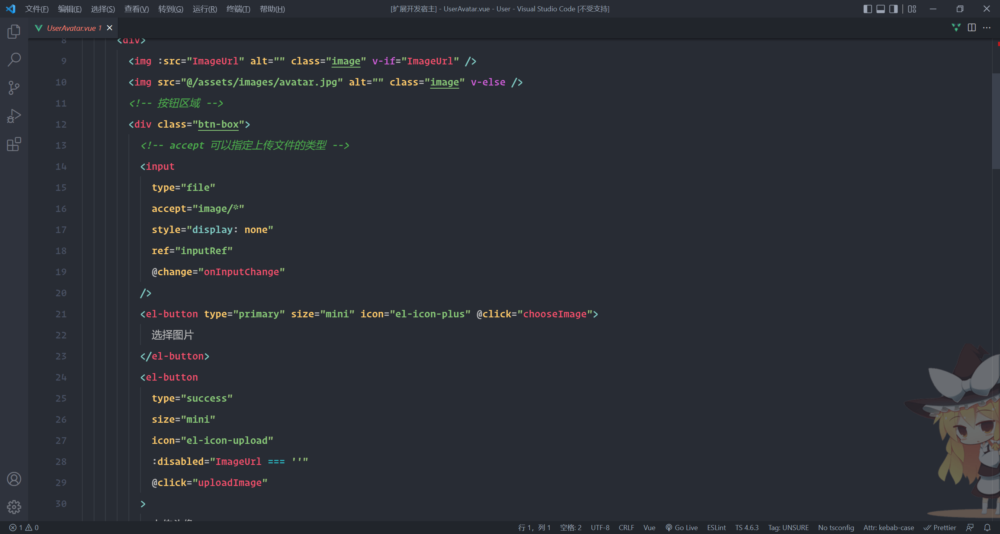

# Theme of hylong

## welcome to my first vscode plugin !

## You will write code more happily when you see the color of theme.

## Tips: 

~~~json
"editor.fontSize": 18,
"editor.lineHeight": 36,
"editor.fontFamily": "Operator Mono Medium,'Fira Code Retina','JetBrains Mono'",
~~~

## hylong-dark-theme

## hylong-dark-light-theme

**enjoy**